# Pagerland

Pagerland is offers a great, smooth looking and fast landing page templates built on Gatsby and React.

Original designs crafted in Figma suits perfectly for marketing, startups and all creative needs.
Pagerland main theme can be easily customized by users.

## Installation

After purchasing Pagerland theme from Themeforest you will find PagerLand.zip file. You need to unzip this archive
and run following commands on the unzipped directory to get started.

```shell script
yarn install
```

Pagerland supports yarn monorepo which means in one project you will have multiple configurations - Next.JS and Gatsby.

For both versions - Next.JS and Gatsby - are available the same routes. One route contains one example of usage theme.
Every newly added theme will be also added to the route list.  
Available routes:

- /mobile-app
- /mobile-app-2
- /web-app
- /startup
- /real-estate
- /corporate

## Next.JS

Pagerland based on React is fully supported by Next.js and adapted to work with SSR (Server Side Rendering)
which significantly improves SEO (Search Engine Optimisation) which means you’re website will be more visible
in Google search results.

If you want to start working with Next.JS version, just use the following command:

```shell script
yarn next:dev
```

They are also available commands for building and serve the production environment:

```shell script
yarn next:build
yarn next:start
```

## Gatsby

Gatsby based version is focused on achieving the best results in Lighthouse audits which finds specific errors
and shows suggestions what to improve to make your website fast and accessible for everyone.
Of course Gatsby version also improves SEO results.

To start working with Gatsby you can simply run the development server with command:

```shell script
yarn gatsby:dev
```

They are also available commands for building and serve the production environment:

```shell script
yarn gatsby:build
yarn gatsby:start
```

## Development

To improve the development process we created CLI (Command Line Interface) application which allows you easily
extract a desirable theme on a specified platform. There is no need to copy-pasting files from different directories
and going through Next.JS/Gatsby configurations.

To install CLI command run in PagerLand directory:

```shell script
yarn global add file:$PWD
```

After installing you will have access to bash script `pagerland-init`.
You can run this in a place where you want to create a new project with Pagerland theme.  
The process of creating a new project with a preinstalled theme is simple, you have just to answer
for three questions - what should be the name of your project, which platform you want to use and which theme.  
The script will automatically create a new project with a single index route with a selected theme and remove
all unnecessary files related to other themes.

> **Note!**  
> If you are using Google Maps you have to specify your Google API Map key in env variables - as _GOOGLE_MAPS_KEY_
> or _GATSBY_GOOGLE_MAPS_KEY_ if you are using Gatsby.
> You can do this by exporting this variable to your local envs or by adding `.env` file in the which will
> be placed where you have next.config.js or gatsby-config.js files.



### File structure

- `packages`

  - `api` - contains simple lambda function to handle creating tickets in Freshdesk - used by our landing page
  - `cli` - source code of `pagerland-init` script
  - `common` - all common components and utils shared through templates and environments
  - `docs` - Storybook config
  - `icons` - package with React Components of common icons
  - `pagerland-gatsby` - Gatsby version of the project
  - `pagerland-next` - Next.JS version of the project
  - `pagerland-landing` - Our landing page
  - `themes` - all theme configurations and containers

### Styled components and styled system

Pagerland uses components based on Styled Components and Styled System which allow easy editing them.
All the templates are built with predefined settings that offer basic customization of colours, fonts etc.
Containers used to build themes are written in raw React.JS. Thanks to that you can easily change the appearance
of particular containers. By changing default props of containers you can create a completely different structure
of the selected theme.  
The best example are themes "Mobile App" and "Mobile App 2". They use the same theme, but Mobile App 2
have changed default props to rearrange view.

### Stack we have used to build Pagerland

- Yarn + workspaces
- React, Gatsby, Next.JS
- Node.JS
- Styled components and styled system
- Now.sh deployment

### Documentation

All UI components used by Pagerland themes has full documentation and examples available on Storybook.  
To run your local version of the documentation you can run command in PagerLand catalog:

```shell script
yarn docs
```

### Requirements

- Node >12
- Yarn >1.10

## Deployment

Our templates are built on non-modified Next.JS or Gatsby and are ready to deploy in every common platform.
As we use original Next.JS and Gatsby you can just follow instructions of your favourite platform,
for example, https://www.gatsbyjs.org/docs/deploying-to-zeit-now/
